 

 

## `🌻` about me

- 🎓 3rd-year **B.Tech CSE (Data Science)** student at Manipal University Jaipur
- 🌱 aspiring **Data Science Engineer**, currently deep in **DSA**
- 🧠 curious about **AI/ML, NLP, RAG** and building intelligent little applications
- 💼 some real-world mileage from an **AI Engineering Internship**
- 📚 outside of code: novels, music, dancing, and an unreasonable amount of apple juice
- ⚡️ Harry Potter person, 🦡 Hufflepuff through and through
- 🌻 will talk about sunflowers for longer than is probably normal

## 🌱 currently watering

| | |
|---|---|
| 🌿 **learning** | DSA |
| 🏗️ **building** | resume-assistant |
| 🎧 **listening to** | K-pop + Dua Lipa |
| 🌊 **trying to** | touch the sea |

## 🌻 things i've grown

<table>
<tr>
<td width="33%" valign="top">

**🔍 AI Resume Screening System**

An ATS-style resume screener using semantic embeddings + FAISS retrieval, with RAG-based recruiter analysis, hybrid scoring, role prediction, and missing-skill detection.

`Python` `Streamlit` `FAISS` `Sentence-Transformers` `LangChain` `NLP` `RAG`

</td>
<td width="33%" valign="top">

**🔎 Financial Fraud Detection Dashboard**

An interactive analytics dashboard for spotting suspicious transactions — fraud filtering, distribution analysis, and high-risk activity visualization over large-scale financial data.

`Python` `Streamlit` `Pandas` `Data Visualization`

</td>
<td width="33%" valign="top">

**🎤 AI Interview Preparation Assistant**

Parses resumes, extracts technical skills, scores readiness, spots gaps, and generates adaptive interview questions plus a personalized learning roadmap.

`Python` `Streamlit` `NLP` `pdfplumber`

</td>
</tr>
</table>

## 🌼 my little greenhouse (tech stack)

**favorites**

 

**languages**

**web**

**frameworks & AI**

**libraries & ML**

**tools**

## 🌾 experience

**AI Engineering Intern · Noryx**

Worked on the engineering side of applied AI — LLMs, agentic AI workflows, and retrieval-augmented generation, alongside AI evaluation, prompt engineering, backend APIs, and enterprise AI architecture.

## 🌻 growth stats

  

  

🌻 growing, learning, and occasionally debugging 🌻

